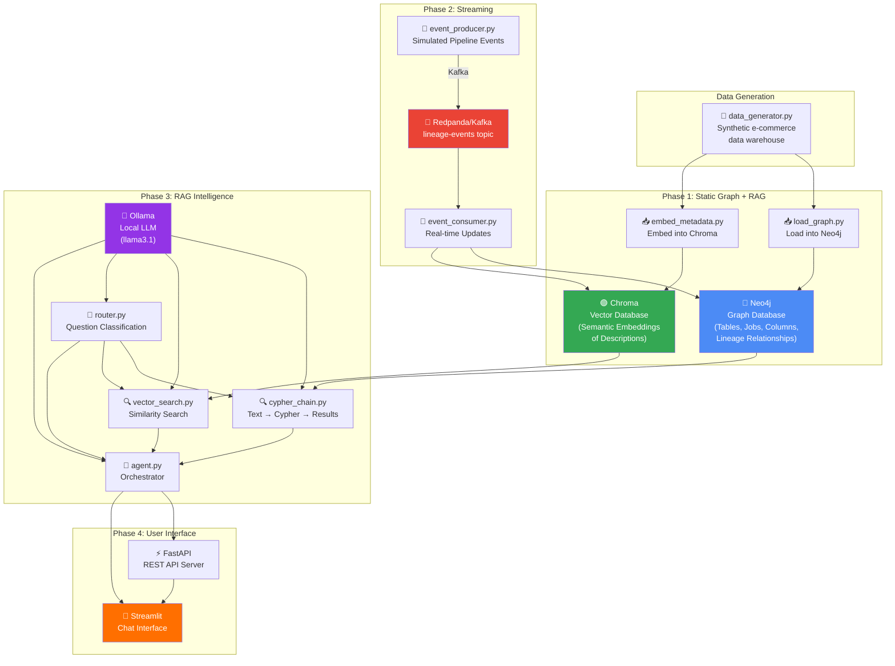

# 🧬 LineageIQ — Real-Time GraphRAG Data Lineage Assistant

> **Ask questions about your data warehouse in plain English.**
> *"What feeds into curated_orders?" • "Why did this pipeline fail?" • "What breaks if I change column Y?"*

LineageIQ is an intelligent assistant that answers natural-language questions about data lineage by combining a **knowledge graph**, a **vector database**, a **large language model (LLM)**, and a **Kafka streaming layer** — all running locally on your machine.

---

## 📖 Table of Contents

- [What is This Project?](#what-is-this-project)
- [Key Concepts Explained](#key-concepts-explained)
- [Architecture](#architecture)
- [Data Flow](#data-flow)
- [Project Structure](#project-structure)
- [Technology Stack](#technology-stack)
- [Prerequisites](#prerequisites)
- [Setup & Installation](#setup--installation)
- [Running the Application](#running-the-application)
- [Sample Questions to Try](#sample-questions-to-try)
- [How Each Module Works](#how-each-module-works)
- [Troubleshooting](#troubleshooting)

---

## What is This Project?

### The Problem
In any data-driven organization, data flows through many stages: raw ingestion → cleaning → transformation → reporting. Understanding this flow (**data lineage**) is critical:
- *"Which tables feed into the daily sales report?"*
- *"If I change the payments table schema, what breaks downstream?"*
- *"Why did the nightly pipeline fail?"*

Traditionally, answering these questions requires manually tracing SQL code, reading documentation, or querying a graph database with specialized query languages like Cypher — skills that not everyone has.

### The Solution
LineageIQ lets anyone ask these questions **in plain English**. Behind the scenes, it:

1. **Routes** the question — Is it structural (about relationships) or semantic (about meaning)?
2. **Retrieves** relevant context — either by generating a graph query (Cypher) or by searching similar descriptions in a vector database, or both.
3. **Synthesizes** a natural-language answer using an LLM, grounded in the actual data — not hallucinated.

This pattern is called **GraphRAG** (Retrieval-Augmented Generation over a Graph) — a cutting-edge approach that goes beyond traditional RAG (which only searches flat documents) by understanding *relationships* between entities.

---

## Key Concepts Explained

### 🔗 Data Lineage
Data lineage tracks the origin, movement, and transformation of data. Think of it as a "family tree" for your data:
- **Table A** is read by **Job X**, which writes to **Table B**
- Therefore, **Table B depends on Table A**
- If Table A breaks, Table B (and everything downstream) is affected

### 🧠 RAG (Retrieval-Augmented Generation)
Instead of asking an LLM to answer from memory (which leads to hallucinations), RAG **retrieves relevant facts first**, then asks the LLM to synthesize an answer from those facts. This grounds the response in reality.

### 📊 GraphRAG
Traditional RAG searches flat documents. GraphRAG adds a **knowledge graph** — a database that stores entities and their *relationships*. This enables answering questions like "what are the upstream dependencies of X?" which require traversing connections, not just matching keywords.

### 📡 Event Streaming (Kafka)
Instead of batch-loading data once a day, a streaming layer processes events **in near-real-time**. When a pipeline runs or a schema changes, an event is emitted to Kafka, consumed, and the graph is updated within seconds.

---

## Architecture



### Architecture in Words

The system has **four layers** that build on each other:

| Layer | What it Does | Technologies |
|---|---|---|
| **Data Layer** | Generates and stores a synthetic e-commerce data warehouse schema with tables, columns, jobs, and lineage edges | Python, JSON, Faker |
| **Storage Layer** | Stores lineage as a graph (Neo4j) and metadata descriptions as vectors (Chroma) | Neo4j, ChromaDB, sentence-transformers |
| **Intelligence Layer** | Converts questions to graph queries or similarity searches, routes between strategies, synthesizes answers | LangChain, Ollama (llama3.1), Prompt Engineering |
| **Interface Layer** | Provides a chat UI and REST API for interacting with the system | Streamlit, FastAPI |

The **streaming layer** (Kafka/Redpanda) runs alongside, continuously updating the graph and vector DB as new events arrive.

---

## Data Flow

Here's exactly what happens when you ask a question:

```
User: "What tables feed into curated_orders?"
                    │
                    ▼
        ┌───────────────────────┐
        │   1. ROUTER            │
        │   Classifies question  │
        │   → "cypher" (it's     │
        │   about relationships) │
        └───────────┬───────────┘
                    │
                    ▼
        ┌───────────────────────┐
        │   2. CYPHER CHAIN      │
        │   LLM generates:       │
        │   MATCH (t:Table       │
        │   {name:'curated_      │
        │   orders'})-[:DEPENDS  │
        │   _ON]->(up:Table)     │
        │   RETURN up.name       │
        └───────────┬───────────┘
                    │
                    ▼
        ┌───────────────────────┐
        │   3. NEO4J EXECUTION   │
        │   Query runs against   │
        │   the graph, returns:  │
        │   [stg_orders,         │
        │    stg_payments,       │
        │    stg_shipping]       │
        └───────────┬───────────┘
                    │
                    ▼
        ┌───────────────────────┐
        │   4. ANSWER SYNTHESIS  │
        │   LLM formats a       │
        │   natural-language     │
        │   response from the   │
        │   raw results          │
        └───────────┬───────────┘
                    │
                    ▼
User sees: "curated_orders depends on three staging tables:
           stg_orders, stg_payments, and stg_shipping.
           These are joined by the build_curated_orders job."
```

For **semantic questions** (e.g., "which tables relate to customer refunds?"), the flow uses vector similarity search instead of Cypher. For **hybrid questions**, both paths are executed and results are merged.

---

## Project Structure

```
LineageIQ/
│
├── config.py                    # 🔧 Central configuration (all connection strings)
├── docker-compose.yml           # 🐳 Docker services (Neo4j, Redpanda)
├── requirements.txt             # 📦 Python dependencies
├── README.md                    # 📖 This file
│
├── data/                        # 📊 Data Layer
│   ├── README.md                #    Module documentation
│   └── synthetic/               #    Generated JSON files
│       ├── tables.json          #      22 tables across 4 warehouse layers
│       ├── columns.json         #      170 columns with descriptions
│       ├── jobs.json            #      21 ETL jobs
│       ├── lineage_edges.json   #      46 read/write relationships
│       └── job_runs.json        #      190 job execution records
│
├── scripts/                     # 🔨 Setup Scripts
│   ├── README.md                #    Module documentation
│   ├── data_generator.py        #    Generates synthetic data warehouse
│   ├── load_graph.py            #    Loads data into Neo4j graph
│   └── embed_metadata.py        #    Embeds descriptions into Chroma
│
├── rag/                         # 🧠 RAG Intelligence Layer
│   ├── README.md                #    Module documentation
│   ├── cypher_chain.py          #    Text → Cypher → Neo4j → Answer
│   ├── vector_search.py         #    Question → Embedding → Chroma → Answer
│   ├── router.py                #    Classifies questions (cypher/vector/hybrid)
│   └── agent.py                 #    Orchestrates the full pipeline
│
├── streaming/                   # 📡 Kafka Streaming Layer
│   ├── README.md                #    Module documentation
│   ├── event_producer.py        #    Simulates pipeline events → Kafka
│   └── event_consumer.py        #    Kafka → Neo4j + Chroma updates
│
├── api/                         # ⚡ REST API
│   ├── README.md                #    Module documentation
│   └── main.py                  #    FastAPI server (4 endpoints)
│
└── ui/                          # 💬 Chat Interface
    ├── README.md                #    Module documentation
    └── app.py                   #    Streamlit chat application
```

---

## Technology Stack

| Technology | Category | What It Is | Why We Use It |
|---|---|---|---|
| **[Neo4j](https://neo4j.com)** | Graph Database | A database optimized for storing and querying *relationships* between entities. Data is stored as nodes (things) and edges (connections). | Lineage is inherently a graph problem — tables connect to jobs connect to other tables. Neo4j lets us traverse these paths efficiently with Cypher queries. |
| **[ChromaDB](https://trychroma.com)** | Vector Database | A database that stores data as high-dimensional vectors (embeddings) and finds "similar" items by mathematical distance. | Enables semantic search — when a user asks "tables about refunds," we find tables whose descriptions are *semantically close* to "refunds," even if the word doesn't appear. |
| **[Ollama](https://ollama.ai)** | Local LLM | Runs large language models locally on your machine. No API keys, no cost, full privacy. | Powers all the intelligence: generating Cypher queries, classifying questions, synthesizing answers. Using llama3.1 model. |
| **[LangChain](https://langchain.com)** | RAG Framework | A Python framework for building LLM-powered applications with chains, prompts, and integrations. | Provides the plumbing: prompt templates, output parsers, model wrappers, Neo4j integration. |
| **[sentence-transformers](https://sbert.net)** | Embeddings | Converts text into numerical vectors that capture semantic meaning. Similar texts → similar vectors. | Generates the embeddings stored in Chroma. Uses the `all-MiniLM-L6-v2` model (runs on CPU, 384-dimensional vectors). |
| **[Apache Kafka](https://kafka.apache.org)** (via [Redpanda](https://redpanda.com)) | Event Streaming | A distributed event streaming platform. Producers publish messages to topics; consumers read them. | Enables near-real-time graph updates. When a pipeline runs, an event is streamed → consumed → graph updated within seconds. |
| **[FastAPI](https://fastapi.tiangolo.com)** | Web Framework | A modern, fast Python web framework for building APIs with automatic documentation. | Wraps the RAG agent as a REST API with endpoints for asking questions, health checks, and schema queries. |
| **[Streamlit](https://streamlit.io)** | UI Framework | A Python framework for building interactive web apps with minimal frontend code. | Provides the chat interface where users type questions and see answers with source citations. |
| **[Docker](https://docker.com)** | Containerization | Packages applications into isolated containers that run consistently on any machine. | Runs Neo4j and Redpanda without complex installation — just `docker-compose up`. |

---

## Prerequisites

Before running the project, ensure you have these installed:

| Prerequisite | Version | Installation |
|---|---|---|
| **Python** | 3.10 or higher | [python.org/downloads](https://python.org/downloads) |
| **Docker Desktop** | Latest | [docker.com/products/docker-desktop](https://docker.com/products/docker-desktop) |
| **Ollama** | Latest | [ollama.ai/download](https://ollama.ai/download) |
| **Git** | Latest | [git-scm.com](https://git-scm.com) (for version control) |

### System Requirements
- **RAM**: 8GB minimum (16GB recommended — Neo4j + Ollama + embeddings)
- **Disk**: ~6GB (LLM model download + Docker images)
- **CPU**: Modern multi-core processor (GPU not required but speeds up embeddings)

---

## Setup & Installation

### Step 1: Clone and Enter the Project
```bash
cd LineageIQ
```

### Step 2: Install Python Dependencies
```bash
pip install -r requirements.txt
```
This installs: `neo4j`, `chromadb`, `sentence-transformers`, `langchain`, `langchain-ollama`, `kafka-python-ng`, `fastapi`, `uvicorn`, `streamlit`, `faker`, `requests`.

### Step 3: Pull the LLM Model
```bash
# Start Ollama (if not running already)
ollama serve

# In another terminal, download the model (~4.7GB)
ollama pull llama3.1
```
> **Note**: The first download takes several minutes. After that, the model loads in seconds.

### Step 4: Start Neo4j Database
```bash
docker-compose up -d
```
Wait ~30 seconds for Neo4j to initialize. You can verify it's running by visiting:
- **Neo4j Browser**: [http://localhost:7474](http://localhost:7474)
- **Login**: Username `neo4j`, Password `lineage123`

### Step 5: Generate Synthetic Data (already done if you cloned the repo)
```bash
python scripts/data_generator.py
```
This creates JSON files in `data/synthetic/` representing a fictional e-commerce data warehouse.

### Step 6: Load Data into Neo4j
```bash
python scripts/load_graph.py --clear
```
This creates **22 table nodes**, **170 column nodes**, **21 job nodes**, **190 job run nodes**, and all their relationships in Neo4j.

### Step 7: Embed Metadata into Chroma
```bash
python scripts/embed_metadata.py
```
This converts all table/column descriptions into 384-dimensional vectors and stores them in the local Chroma database.

### Step 8: Launch the Chat Interface
```bash
streamlit run ui/app.py
```
Open [http://localhost:8501](http://localhost:8501) in your browser. Start asking questions!

---

## Running the Application

### Quick Start (Direct Mode)
The simplest way — the UI talks directly to the RAG agent in the same process:
```bash
streamlit run ui/app.py
```

### With API Server (API Mode)
For a production-like setup with a separate backend:
```bash
# Terminal 1: Start the API server
python api/main.py
# API docs at http://localhost:8000/docs

# Terminal 2: Start the UI
streamlit run ui/app.py
# Switch to "API Mode" in the sidebar
```

### With Kafka Streaming (Phase 2)
To enable real-time graph updates:
```bash
# 1. Edit docker-compose.yml — uncomment the Redpanda section
# 2. Restart Docker
docker-compose up -d

# Terminal 1: Start the consumer (waits for events)
python streaming/event_consumer.py

# Terminal 2: Start the producer (emits events every 5 seconds)
python streaming/event_producer.py --interval 5

# Terminal 3: Run the UI and watch the graph update in real-time!
streamlit run ui/app.py
```

### Command-Line Agent (No UI)
For quick testing without the UI:
```bash
python rag/agent.py
# Type questions, get answers. Type 'quit' to exit.
```

---

## Sample Questions to Try

### Structural Questions (→ Cypher Route)
These query the graph for relationships and paths:
- *"What tables feed into curated_orders?"*
- *"What does the build_curated_orders job read from?"*
- *"Show me the upstream dependencies of rpt_daily_sales"*
- *"Did any jobs fail recently?"*
- *"What columns does the curated_orders table have?"*
- *"What jobs write to the curated layer?"*

### Semantic Questions (→ Vector Route)
These search descriptions by meaning:
- *"Which tables relate to customer refunds?"*
- *"Find tables about shipping performance"*
- *"What data do we have about payment methods?"*
- *"Which tables store information about product pricing?"*

### Hybrid Questions (→ Both Routes)
These need both structural and semantic context:
- *"Explain the lineage of the daily sales report and what data it contains"*
- *"What customer-related tables feed into the revenue report?"*

---

## How Each Module Works

### 📊 `data/` — Synthetic Data
Generates a fictional "ShopStream" e-commerce data warehouse with 4 layers:
- **Raw** (7 tables): Data lands here from source systems, untransformed
- **Staging** (7 tables): Cleaned, validated, deduplicated
- **Curated** (4 tables): Business logic applied, conformed dimensions
- **Reporting** (4 tables): Aggregated, dashboard-ready

→ See [data/README.md](data/README.md)

### 🔨 `scripts/` — Setup Scripts
Three scripts to populate the databases:
1. **data_generator.py** — Creates the synthetic dataset
2. **load_graph.py** — Loads everything into Neo4j as a graph
3. **embed_metadata.py** — Embeds descriptions into Chroma for semantic search

→ See [scripts/README.md](scripts/README.md)

### 🧠 `rag/` — RAG Intelligence Layer
The brain of the system — four components that work together:
1. **router.py** — Classifies each question as cypher/vector/hybrid
2. **cypher_chain.py** — Converts questions to Cypher, queries Neo4j
3. **vector_search.py** — Finds semantically similar metadata in Chroma
4. **agent.py** — Orchestrates everything and synthesizes final answers

→ See [rag/README.md](rag/README.md)

### 📡 `streaming/` — Kafka Streaming Layer
Real-time event processing:
1. **event_producer.py** — Simulates pipeline events (job runs, schema changes)
2. **event_consumer.py** — Consumes events and updates Neo4j + Chroma in real-time

→ See [streaming/README.md](streaming/README.md)

### ⚡ `api/` — FastAPI REST API
Wraps the agent as an HTTP API with 4 endpoints:
- `POST /api/ask` — Submit a question
- `GET /api/health` — System health check
- `GET /api/schema` — Graph schema summary
- `GET /api/history` — Recent Q&A history

→ See [api/README.md](api/README.md)

### 💬 `ui/` — Streamlit Chat Interface
A web-based chat UI with:
- Chat-style message history
- Sample questions (one-click)
- System status indicators
- Source citations and route indicators
- Direct Mode (in-process) and API Mode (via FastAPI)

→ See [ui/README.md](ui/README.md)

---

## Troubleshooting

| Issue | Solution |
|---|---|
| `docker-compose up` fails | Ensure Docker Desktop is running. On Windows, check WSL2 is enabled. |
| Neo4j connection refused | Wait 30 seconds after `docker-compose up`. Check `http://localhost:7474`. |
| `ollama pull` is slow | Normal for first download (~4.7GB). Subsequent starts are fast. |
| `ModuleNotFoundError` | Run `pip install -r requirements.txt` from the `LineageIQ` directory. |
| Streamlit shows red errors | Check that Neo4j and Ollama are running. The sidebar shows status indicators. |
| Kafka connection refused | Ensure you've uncommented the Redpanda section in `docker-compose.yml` and restarted. |
| LLM responses are slow | First query loads the model (~30s). Subsequent queries are faster. Consider a smaller model: `ollama pull llama3.2:1b`. |
| Unicode errors on Windows | Set `$env:PYTHONIOENCODING='utf-8'` before running Python scripts. |

---

## Configuration

All settings are in [`config.py`](config.py) and can be overridden via environment variables:

| Variable | Default | Description |
|---|---|---|
| `NEO4J_URI` | `bolt://localhost:7687` | Neo4j connection URI |
| `NEO4J_USER` | `neo4j` | Neo4j username |
| `NEO4J_PASSWORD` | `lineage123` | Neo4j password |
| `CHROMA_PERSIST_DIR` | `data/chroma_db` | Chroma storage path |
| `OLLAMA_BASE_URL` | `http://localhost:11434` | Ollama API endpoint |
| `OLLAMA_MODEL` | `llama3.1` | LLM model name |
| `KAFKA_BOOTSTRAP_SERVERS` | `localhost:9092` | Kafka broker address |
| `API_HOST` | `0.0.0.0` | FastAPI bind address |
| `API_PORT` | `8000` | FastAPI port |

---

## License

This is a personal portfolio project. Feel free to learn from it and adapt it for your own use.
