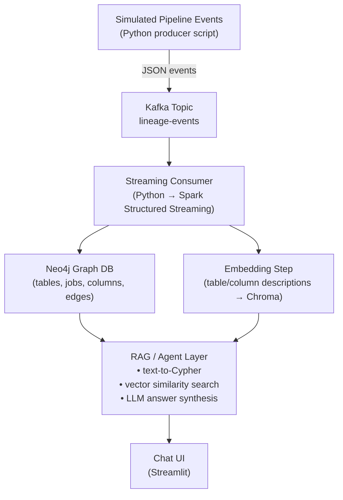

# Real-Time LineageIQ - Implementation Plan

## What This Project Is

A **natural-language data lineage assistant** that combines four major technologies into one coherent system:

| Concern | What It Does |
|---|---|
| **Kafka streaming** | Ingests simulated pipeline events (job runs, schema changes) in near-real-time |
| **Neo4j graph DB** | Stores and queries the lineage graph (tables → jobs → columns → edges) |
| **Vector DB (Chroma)** | Enables semantic similarity search over table/column descriptions |
| **LLM + RAG** | Converts plain-English questions into Cypher queries and/or vector searches, synthesizes answers |

The end result: a user asks _"what feeds into table X?"_ or _"why did this pipeline fail last night?"_ and gets a grounded, context-rich answer from the system.

---

## Architecture Flow



---

## Build Phases — Step-by-Step Breakdown

### Phase 1 — Static Graph + Basic RAG (Foundation)

This is the **minimum viable system**: load data statically, get one question type working end-to-end.

#### Step 1.1: Synthetic Data Generation
- [ ] Create a Python script (`data_generator.py`) using **Faker** to generate:
  - A fictional e-commerce data warehouse schema (15–30 tables: `orders`, `customers`, `payments`, `shipping_events`, staging tables, curated tables)
  - Column definitions with short natural-language descriptions for each
  - 10–20 pipeline/job definitions that read from some tables and write to others (these define lineage edges)
- [ ] Output formats: JSON files for tables, columns, jobs, and lineage edges

#### Step 1.2: Neo4j Setup & Static Graph Load
- [ ] Stand up Neo4j via **Docker** (`docker-compose.yml`)
- [ ] Write a loader script (`load_graph.py`) to ingest the synthetic data as nodes and relationships:
  - Node types: `Table`, `Column`, `Job`
  - Relationship types: `READS_FROM`, `WRITES_TO`, `HAS_COLUMN`, `DEPENDS_ON`
- [ ] Verify with a few Cypher queries in the Neo4j browser

#### Step 1.3: Vector DB Setup (Chroma)
- [ ] Install Chroma (`pip install chromadb`)
- [ ] Write an embedding script (`embed_metadata.py`) that:
  - Takes all table/column descriptions
  - Generates embeddings (via OpenAI/Anthropic API or a local model like `sentence-transformers`)
  - Stores them in a Chroma collection

#### Step 1.4: Basic Text-to-Cypher RAG Chain
- [ ] Choose LLM provider: **Anthropic Claude API** (recommended) or OpenAI, or **Ollama** for local/free
- [ ] Choose RAG framework: **LangChain** or **LlamaIndex** (pick one)
- [ ] Build the chain: User question → LLM generates Cypher → query Neo4j → LLM formats the answer
- [ ] Get **one question type** working end-to-end: _"What tables feed into curated_orders?"_

---

### Phase 2 — Add Kafka Streaming (The Streaming Gap-Closer)

This phase adds the **real-time ingestion layer** — the differentiating piece.

#### Step 2.1: Kafka Setup
- [ ] Add Kafka to `docker-compose.yml` (use **Redpanda** — it's Kafka-compatible and much easier to run locally)
- [ ] Create a Kafka topic: `lineage-events`

#### Step 2.2: Event Producer
- [ ] Write a producer script (`event_producer.py`) that periodically emits JSON events:
  ```json
  {
    "job": "load_orders",
    "reads": ["stg_orders"],
    "writes": ["curated_orders"],
    "status": "success",
    "timestamp": "2026-08-23T12:00:00Z"
  }
  ```
- [ ] Include both `success` and `failure` statuses to enable "why did X fail?" queries later

#### Step 2.3: Streaming Consumer
- [ ] Start with a **plain Python consumer** (`kafka-python` library) that:
  - Reads events from `lineage-events`
  - Updates the Neo4j graph (creates new nodes/edges, or marks job runs as failed)
  - Re-embeds any new/changed descriptions into Chroma
- [ ] **Upgrade path**: Once the plain consumer works, refactor to **Spark Structured Streaming** to demonstrate that skill
- [ ] Measure and log latency: _"graph updates within X seconds of an event"_

---

### Phase 3 — RAG/Agent Layer Maturity (Intelligence)

This phase makes the system smart enough to handle diverse question types.

#### Step 3.1: Query Routing
- [ ] Build routing logic to classify questions:
  - **Structural** → Cypher query (e.g., _"what depends on table X"_)
  - **Semantic** → vector search (e.g., _"which tables relate to customer refunds"_)
  - **Hybrid** → both
- [ ] Can use a simple classifier or an agent framework's built-in routing

#### Step 3.2: Answer Grounding
- [ ] Show the actual **graph path** or **retrieved chunks** alongside the LLM's answer
- [ ] This demonstrates understanding that RAG ≠ "just trust the LLM"

#### Step 3.3: Failure Analysis
- [ ] Handle _"why did load_orders fail last night?"_ by querying job-status events from the streaming layer

---

### Phase 4 — Polish, UI, Deployment (Portfolio-Ready)

#### Step 4.1: Streamlit Chat UI
- [ ] Build a minimal but functional chat interface with **Streamlit**
- [ ] Show lineage graph visualizations alongside answers

#### Step 4.2: FastAPI Backend
- [ ] Wrap the RAG/agent layer in a **FastAPI** service
- [ ] Streamlit calls FastAPI; this separates concerns cleanly

#### Step 4.3: Deployment & Documentation
- [ ] Deploy locally or on free-tier cloud (Streamlit Community Cloud, GCP free-tier)
- [ ] Write a clear README with architecture diagram and demo GIF/video
- [ ] Clean commit history on GitHub

---

## Proposed Project Structure

```
Lineage_ChatBot/
├── docker-compose.yml          # Neo4j + Redpanda (Kafka) + Chroma
├── requirements.txt            # Python dependencies
├── data/
│   └── synthetic/              # Generated JSON data files
├── scripts/
│   ├── data_generator.py       # Faker-based synthetic data generator
│   ├── load_graph.py           # Load static data into Neo4j
│   └── embed_metadata.py       # Embed descriptions into Chroma
├── streaming/
│   ├── event_producer.py       # Kafka event producer (simulated pipeline)
│   └── event_consumer.py       # Kafka consumer → Neo4j + Chroma updates
├── rag/
│   ├── cypher_chain.py         # Text-to-Cypher RAG chain
│   ├── vector_search.py        # Chroma similarity search
│   ├── router.py               # Question routing logic
│   └── agent.py                # Combined agent/orchestrator
├── api/
│   └── main.py                 # FastAPI backend
├── ui/
│   └── app.py                  # Streamlit chat UI
├── tests/
│   └── ...
└── README.md
```

---

## Tech Stack Summary

| Layer | Choice | Install/Setup |
|---|---|---|
| Streaming | **Redpanda** (Kafka-compatible, Docker) | `docker-compose up` |
| Stream processing | Python `kafka-python` → Spark Structured Streaming | `pip install kafka-python` / `pip install pyspark` |
| Graph DB | **Neo4j** (Docker) | `docker-compose up` |
| Vector DB | **Chroma** | `pip install chromadb` |
| Embeddings | `sentence-transformers` or API-based | `pip install sentence-transformers` |
| LLM | **Anthropic Claude** or **Ollama** (local, free) | API key or `ollama pull llama3` |
| RAG framework | **LangChain** (or LlamaIndex) | `pip install langchain langchain-community` |
| API | **FastAPI** | `pip install fastapi uvicorn` |
| UI | **Streamlit** | `pip install streamlit` |
| Data generation | **Faker** | `pip install faker` |

---

## Open Questions

> [!IMPORTANT]
> **LLM Provider Choice**: Do you want to use a paid API (Anthropic Claude / OpenAI — small cost, more reliable) or a local free model via Ollama (zero cost, requires decent hardware)?

> [!IMPORTANT]
> **RAG Framework**: Do you prefer **LangChain** (larger community, more tutorials) or **LlamaIndex** (better native graph/RAG support, less custom code needed)?

> [!NOTE]
> **Scope**: The plan doc wisely notes that **Phase 1 + Phase 2 alone** is already a strong portfolio piece. Do you want to start with just those two phases, or plan for all four from the beginning?

> [!NOTE]
> **Spark Structured Streaming**: The plan suggests starting with a plain Python Kafka consumer and upgrading later. This is the right approach — it avoids fighting two learning curves at once.

---

## Verification Plan

### Per-Phase Verification
- **Phase 1**: Run a test question through the full chain and verify correct Cypher generation + answer
- **Phase 2**: Emit a Kafka event, verify the Neo4j graph updates within seconds, verify new embeddings appear in Chroma
- **Phase 3**: Test routing with structural, semantic, and hybrid questions; verify grounded answers
- **Phase 4**: End-to-end demo through the Streamlit UI

### Automated Tests
```bash
pytest tests/
```

### Manual Verification
- Neo4j Browser: visually inspect the graph
- Chroma: query the collection to verify embeddings
- Kafka: check consumer lag and message throughput
- Chat UI: ask the target question types and verify answers
